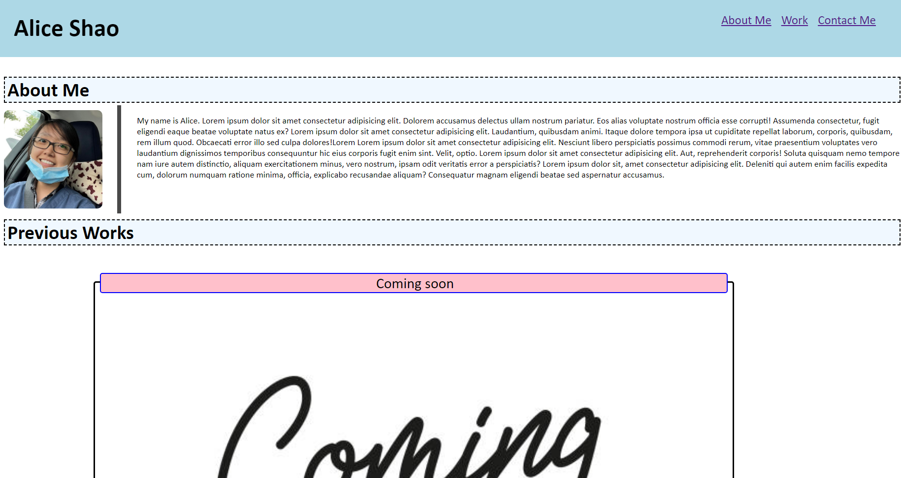

# <Alice's portfolio>

## Description

This is a webpage that serves as a central location for people to view a brief introduction about me and see the previous proects that I have been working on. There are also links on the bottom to further contact me. The page is currently ust a template and can be filled out once I have completed more projects.

## Installation

Page can be viewed at https://alices9.github.io/professional-portfolio/

## Usage

Site can be used to learn a bit more about me and access my contact information. The icons in the header will redirect to their respective sections on the page. The previous project icons are interactive and will link you to the respective projects. They currently do not redirect anywhere but will be updated when more projects are completed.

